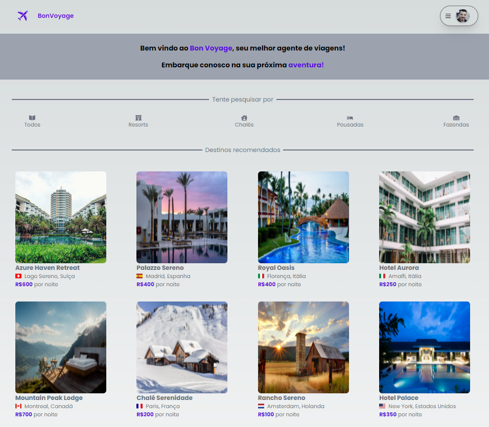

# Fullstack Trips

## Next JS - Next auth - Google Authentication - Back end - Taiwind - Banco de dados
  
## Português:

Meu primeiro projeto Fullstack!

- Usando Next JS, consegui fazer meu primeiro App com back end, criando, consultando e utilizando métodos de API como: GET, POST, e DELETE 
- Também utilizei tailwind para estilizar o App
- Foi necessário também criar o banco de dados, tabelas e regaras do banco 

Link para projeto:
https://fullstack-trips-01.vercel.app

## English:

My first Fullstack project!

- Using Next.js, I managed to build my first app with a backend, creating, querying, and utilizing API methods such as GET, POST, and DELETE.
- I also used Tailwind CSS to style the app.
- It was also necessary to create the database, tables, and database rules.

Link to the project:
https://fullstack-trips-01.vercel.app

